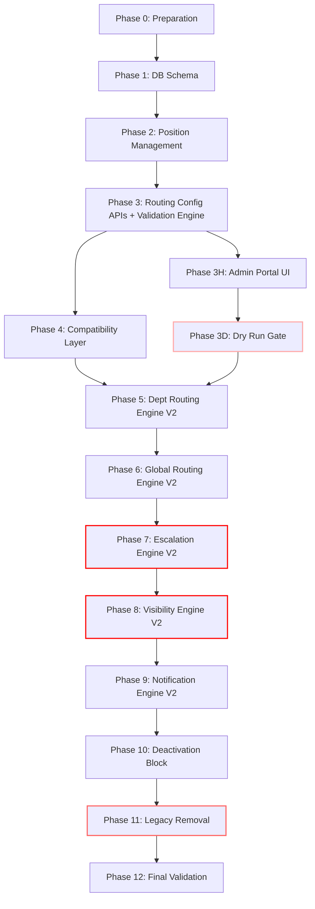

# CAMPUS CONNECT V2
## MIGRATION SPECIFICATION DOCUMENT (MSD) — FINAL REVISION
### V1 → V2: Configurable 3-Level Routing Engine

**Document Status**: FINAL — Definitive Implementation Blueprint
**Classification**: Architecture Planning — Read-Only
**Revision**: 2.0

---

## REVISION LOG

| Rev | Section | Change | Reason |
|---|---|---|---|
| R1 | Phase 1 DB Schema | Removed `position_occupants` table; `current_user_id` added to `positions` | Business rule: exactly one occupant; separate table adds complexity with no benefit |
| R2 | Phase 1 + Phase 5 | Removed `l1_position_id` from `department_routing`; L1 is always `departments.hod_user_id` | L1 already exists; duplication is incorrect |
| R3 | Phase 7 + Phase 4 | Removed Admin fallback on routing failure; replaced with halt + critical alert | Business rule: never orphan tickets; silent admin assignment violates policy |
| R4 | Phase 2 | Strengthened seeding script with normalisation, dedup, conflict detection, report | Prevents silent duplicate positions during migration |
| R5 | Phase 3 | Introduced full validation engine in routing config service | Prevents broken routing configs from being saved |
| R6 | Phase 10 | Added Routing Health Dashboard page | Operational visibility into routing integrity before and after cutover |
| R7 | New Phase 3.5 | Added Dry Run Gate before Phases 7 and 8 can be enabled | Prevents deployment when configuration is incomplete |
| R8 | Phase 1 | Added `routing_config_version` table and `config_version_id` column to `ticket_assignments` | Full auditability of which config governed each assignment |
| R9 | All Phases | Strengthened each phase with Preconditions, Gate, Exit Criteria | No phase may begin without satisfying every gate |
| R10 | Phase Order | Admin Portal (Phase 10) moved to immediately after Phase 3 | Config UI must exist BEFORE backend cutover phases |

---

# PART I — BASELINE SNAPSHOT

## 1. Executive Summary

This document defines the complete, phase-by-phase migration plan from Campus Connect V1 (partially hardcoded routing) to V2 (fully configurable, position-based routing). Every phase satisfies four inviolable constraints:

1. **The application compiles at every phase boundary.**
2. **Existing functionality regresses at no point.**
3. **Every phase is independently deployable and testable.**
4. **Every phase has a defined, tested rollback path.**

**Architectural Decisions (Final):**
- Exactly THREE routing levels. No unlimited routing.
- Routing changes affect only future tickets. Existing tickets never move automatically.
- `ticket_assignments` is the immutable single source of truth.
- Routing is Position-based. Users occupy Positions. Positions outlive Users.
- Exactly ONE active occupant per Position at any time.
- User deactivation is blocked while active tickets exist.
- Visibility must never depend on designation strings.
- Notifications must never depend on designation strings.
- Role, Position, Assignment, and Permission are completely independent concepts.

---

## 2. Current Architecture Snapshot (V1 Baseline)

### 2.1 Database — Current State

| Table | Role in Routing | V1 Status |
|---|---|---|
| `departments` | Owns `hod_user_id` (L1 Department Assignee) | Active |
| `global_assignments` | Owns `user_id` per `routing_key` (L1 Global Assignee) | Active |
| `ticket_assignments` | Immutable history of all assignments | Active, SSOT |
| `tickets` | Mirrors current assignee via `assigned_to_name`, `assigned_role` | Active, Redundant Fields |
| `users` | Stores `designation` as a free-text `VarChar(100)` | Active, String-Based |
| `escalation_history` | Immutable escalation trail | Active |
| `system_settings` | Holds SLA hours in JSON `escalation_settings` key | Active |

**Missing in V1:**
- No `positions` table
- No `department_routing` table (L2/L3 config per department)
- No `global_routing` table (L2/L3 config per routing key)
- No `routing_config_versions` table

### 2.2 Routing — Current State

**Department Routing (L1):** `tickets.service.ts:227–255`
```
Creator's department_id
  → departments.hod_user_id (explicit FK)
  → Fallback: users.findFirst({ designation: 'HOD' }) [HARDCODED]
  → Fallback: users.findFirst({ designation: 'Admin' }) [HARDCODED]
```

**Global Routing (L1):** `tickets.service.ts:209–224`
```
location.routing_key
  → global_assignments.user_id (WHERE is_active = true)
  → Fallback: Admin [HARDCODED]
```

**Escalation (L2):** `src/cron/escalation.ts:65–76`
```
SLA Breach at L1
  → users.findFirst({ designation: 'Principal' }) [HARDCODED STRING]
  → Fallback string: 'Principal' with user_id = null [HARDCODED FALLBACK]
```

**Escalation (L3):** `src/cron/escalation.ts:122–133`
```
SLA Breach at L2
  → users.findFirst({ designation: 'Director' }) [HARDCODED STRING]
  → Fallback string: 'Director' with user_id = null [HARDCODED FALLBACK]
```

### 2.3 Visibility — Current State

`src/services/visibility.service.ts`
- **Admin/Principal**: `isAdmin()` checks `role === 3 || designation === 'Principal'` → Full access
- **HOD**: `designation === 'HOD'` → Sees all dept tickets via `AssignmentRepository`
- **Staff**: Latest assignment match only
- **Student/Parent**: Creator ID match only

**Critical Problem**: Admin check conflates role integer `3` with the string `'Principal'`. If a Principal user does not have `role = 3`, they are invisible to ticket access.

### 2.4 Notifications — Current State

`src/services/fcm.service.ts:184–208`
- `broadcastToRole('PRINCIPAL')` → `users.findMany({ designation: 'Principal' })` [HARDCODED]
- `broadcastToRole('HOD')` → `users.findMany({ designation: 'HOD' })` [HARDCODED]
- `broadcastToRole('ADMIN')` → `users.findMany({ role: 1 })` *(Confirmed Bug: queries role=1 which is Staff, not Admin=3)*

### 2.5 User Deactivation — Current State

`src/services/admin-users.service.ts:286–326`
- **No orphan protection.** A user can be soft-deleted while holding active tickets.

### 2.6 Global Routing Keys — Current State

`src/constants/routing-keys.ts` — 9 hardcoded routing keys. Adding a new key requires modifying source code and redeploying.

### 2.7 Current API Inventory

| Method | Endpoint | Routing Dependent? | Risk |
|---|---|---|---|
| `POST` | `/api/tickets` | **YES** — L1 assignment at creation | Critical |
| `GET` | `/api/tickets` | **YES** — Visibility clause | Critical |
| `GET` | `/api/tickets/:id` | **YES** — Visibility clause | Critical |
| `PUT` | `/api/tickets/:id` | **YES** — Modification permission | High |
| `GET` | `/api/departments/:id/dashboard` | YES — dept ownership query | Medium |
| `POST` | `/api/departments/:id/bulk-transfer` | YES — transfer validation | Medium |
| `GET` | `/api/admin/routing/assignments` | YES — L1 global config | Low |
| `POST` | `/api/admin/routing/assignments` | YES — L1 global config | Low |
| `GET` | `/api/admin/routing/keys` | YES — hardcoded keys list | Low |

---

# PART II — DEPENDENCY ORDER

## 3. Dependency Graph



**Critical Rule**: Phase 3D (Dry Run Gate) must pass 100% before Phases 7 and 8 can be enabled in production.

**REVISED ORDER** (from original): Admin Portal UI promoted from Phase 10 to Phase 3H (immediately after routing config APIs). This ensures that routing configurations can be populated by Admins before any backend cutover phases begin.

---

# PART III — COMPLETE PHASE-BY-PHASE PLAN

---

## PHASE 0 — Preparation

**Objective**: Establish the foundation without touching any production logic.

**Preconditions**: None.

**Actions:**
- Add `ROUTING_V2_ENABLED` environment variable flag (defaults to `false`).
- Create comprehensive regression test suite for V1 routing covering all ticket creation paths, escalation paths, and visibility paths.
- Snapshot the `escalation_settings` JSON structure from `system_settings`.

**Deployment Gate**: All V1 regression tests pass. Flag defaults to `false` and has no runtime effect.

**Exit Criteria**: Project compiles. V1 regression suite passes 100%. `.env.example` documents new flag.

**Files to Modify**: `.env.example`, `README.md`
**Files NOT to Modify**: Any service, repository, or controller
**Database Changes**: None
**Risk Level**: None
**Rollback**: Remove env var. No impact.
**Estimated Effort**: 0.5 days

---

## PHASE 1 — Database Schema Additions *(R1, R2, R8 Applied)*

**Objective**: Introduce new V2 tables without touching any existing tables.

**Preconditions**: Phase 0 exit criteria met.

### ⚙️ REVISION R1 — Simplified Position Schema
**Removed**: `position_occupants` (separate table).
**Reason**: The business rule mandates exactly one active occupant per position at all times. A separate history table adds query complexity and join overhead with no benefit. Occupant history is already captured in `audit_logs`. The simplified design stores `current_user_id` directly in `positions`.

### ⚙️ REVISION R2 — No L1 Duplication in Department Routing
**Removed**: `l1_position_id` from `department_routing`.
**Reason**: Department L1 already exists as `departments.hod_user_id`. Duplicating it in `department_routing` creates two sources of truth for L1 assignment, which is an architectural contradiction.

### ⚙️ REVISION R8 — Configuration Versioning
**Added**: `routing_config_versions` table and `config_version_id` column on `ticket_assignments`.
**Reason**: Every assignment must carry a reference to the routing configuration that governed it, enabling full auditability of why a ticket was routed a specific way.

---

### New Tables

#### `positions`
```sql
id               INT            PRIMARY KEY AUTOINCREMENT
name             NVARCHAR(150)  NOT NULL UNIQUE
description      NVARCHAR(500)  NULL
current_user_id  VARCHAR(36)    NULL FK -> users(id) ON DELETE NO ACTION
is_active        BIT            NOT NULL DEFAULT 1
created_at       DATETIME       DEFAULT sysutcdatetime()
updated_at       DATETIME       DEFAULT sysutcdatetime()
```
*`current_user_id` is nullable to represent a Vacant Position.*

#### `department_routing`
*(L2 and L3 only. L1 = `departments.hod_user_id` — unchanged.)*
```sql
department_id      INT          NOT NULL PK FK -> departments(id) ON DELETE NO ACTION
l2_position_id     INT          NULL FK -> positions(id) ON DELETE NO ACTION
l3_position_id     INT          NULL FK -> positions(id) ON DELETE NO ACTION
config_version_id  INT          NULL FK -> routing_config_versions(id)
updated_at         DATETIME     DEFAULT sysutcdatetime()
updated_by         VARCHAR(36)  NULL FK -> users(id)
```

#### `global_routing`
*(L2 and L3 only. L1 = `global_assignments.user_id` — unchanged.)*
```sql
routing_key        VARCHAR(100)  NOT NULL PK
l2_position_id     INT           NULL FK -> positions(id) ON DELETE NO ACTION
l3_position_id     INT           NULL FK -> positions(id) ON DELETE NO ACTION
config_version_id  INT           NULL FK -> routing_config_versions(id)
updated_at         DATETIME      DEFAULT sysutcdatetime()
updated_by         VARCHAR(36)   NULL FK -> users(id)
```

#### `routing_config_versions` *(New — R8)*
```sql
id           INT           PRIMARY KEY AUTOINCREMENT
version_tag  VARCHAR(50)   NOT NULL   -- e.g. "2026-07-03T10:00:00Z"
snapshot     NVARCHAR(MAX) NOT NULL   -- JSON snapshot of full routing state at time of save
created_by   VARCHAR(36)   NULL FK -> users(id)
created_at   DATETIME      DEFAULT sysutcdatetime()
```

---

### Columns Added to Existing Tables

| Table | Column | Type | Purpose |
|---|---|---|---|
| `ticket_assignments` | `config_version_id` | INT NULL FK → `routing_config_versions(id)` | Records which config version governed this assignment |

---

### Indexes
- `IX_positions_active_user` on `positions(current_user_id)` WHERE `is_active = 1`
- `IX_dept_routing_l2` on `department_routing(l2_position_id)`
- `IX_dept_routing_l3` on `department_routing(l3_position_id)`

### Deprecation Schedule (NOT removed in this phase)
- `tickets.assigned_to_name` — Removed in Phase 11
- `tickets.assigned_role` — Removed in Phase 11

**Deployment Gate**: Migration runs cleanly. All existing tables untouched. Existing queries continue to pass.

**Exit Criteria**: `prisma migrate deploy` succeeds. `tsc` compiles. All V1 tests pass.

**Files to Modify**: `prisma/schema.prisma`
**Files NOT to Modify**: Any service, controller, or repository
**Risk Level**: Very Low — additive only
**Rollback**: `prisma migrate reset` to prior snapshot. No existing data affected.
**Estimated Effort**: 1 day

---

## PHASE 2 — Position Management Service & APIs *(R4 Applied)*

**Objective**: Build the full CRUD for Positions. No routing is changed yet.

**Preconditions**: Phase 1 exit criteria met.

**New Files:**
- `src/services/positions.service.ts`
- `src/controllers/positions.controller.ts`
- `src/routes/positions.routes.ts`
- `src/validators/position.schema.ts`

**New API Endpoints:**

| Method | Endpoint | Description |
|---|---|---|
| `GET` | `/api/admin/positions` | List all positions (with occupancy status) |
| `POST` | `/api/admin/positions` | Create a position |
| `PUT` | `/api/admin/positions/:id` | Edit position name/description |
| `DELETE` | `/api/admin/positions/:id` | Deactivate (blocked if used in routing config) |
| `PUT` | `/api/admin/positions/:id/occupant` | Assign or replace current occupant |
| `DELETE` | `/api/admin/positions/:id/occupant` | Remove current occupant (set to vacant) |

**Business Rules Enforced:**
1. Position cannot be deactivated if referenced in `department_routing` or `global_routing`.
2. Replacing an occupant: updates `positions.current_user_id` atomically and logs the change to `audit_logs`.
3. Removing an occupant: sets `positions.current_user_id = null` (Vacant state).

---

### ⚙️ REVISION R4 — Improved Position Seeding Script

**Previous**: Seeding script read distinct `designation` values from `users` and created positions directly.
**Problem**: Free-text designations may have casing variants (`hod` / `HOD` / `Hod`), leading/trailing whitespace, or outright duplicates.

**Revised Seeding Procedure** (`scripts/seed-positions.ts`):

```
Step 1: Extract
  → Read all distinct non-null designation values from users

Step 2: Normalise
  → Trim whitespace from every value
  → Apply title case (e.g. "hod " → "HOD", "principal" → "Principal")

Step 3: Deduplicate
  → Group normalised values
  → If two source strings normalise to the same value, merge them

Step 4: Conflict Detection
  → Check if a position with that normalised name already exists in the DB
  → If yes: skip creation, log "ALREADY_EXISTS"
  → If no: create position

Step 5: Occupant Assignment
  → For each created/matched position, find the most recently active user
    with a matching (normalised) designation value
  → Set positions.current_user_id to that user's ID

Step 6: Migration Report
  → Print a structured report:
    - Positions Created: N
    - Positions Already Existed: N
    - Occupants Assigned: N
    - Vacant Positions: N
    - Conflicting Names (manual review needed): [list]
    - Skipped (null designation): N

Step 7: Validation
  → Abort if any Position name conflict cannot be resolved automatically
  → Never silently create duplicate positions
```

**Script output is written to `scripts/seed-positions-report.json`** for admin review before proceeding to Phase 3.

**Deployment Gate**: Seeding report reviewed and approved. Zero conflicting names unresolved. All V1 tests pass.

**Exit Criteria**: `positions` table populated. Admin can view, create, and assign occupants via API.

**Files NOT to Modify**: All existing routing services, visibility, escalation
**Risk Level**: Very Low — pure addition
**Rollback**: Truncate `positions` table. Remove new routes from `index.ts`.
**Estimated Effort**: 2.5 days (extra 0.5 for seeding script hardening)

---

## PHASE 3 — Routing Configuration Service & APIs *(R5 Applied)*

**Objective**: Build the Admin interface for reading and writing L2/L3 routing config with a full validation engine.

**Preconditions**: Phase 2 exit criteria met. Seeding report approved.

**New Files:**
- `src/services/routing-config.service.ts`
- `src/services/routing-validator.service.ts` *(new — R5)*
- `src/controllers/routing-config.controller.ts`
- `src/routes/routing-config.routes.ts`

**New API Endpoints:**

| Method | Endpoint | Description |
|---|---|---|
| `GET` | `/api/admin/routing/departments` | List all department routing configs with health status |
| `PUT` | `/api/admin/routing/departments/:id` | Set L2/L3 positions for a department |
| `GET` | `/api/admin/routing/global` | List all global routing configs with health status |
| `PUT` | `/api/admin/routing/global/:key` | Set L2/L3 positions for a routing key |
| `GET` | `/api/admin/routing/preview/:type/:id` | Simulate escalation chain for a ticket |
| `POST` | `/api/admin/routing/validate` | Run full validation engine and return report |

---

### ⚙️ REVISION R5 — Validation Engine

Every `PUT` to a routing config endpoint invokes `RoutingValidatorService.validate()` **before** saving.

**Validation Rules:**

| Rule ID | Rule | Blocking? | Error Message |
|---|---|---|---|
| V001 | L2 position must exist and be active | YES | `L2 position not found or inactive` |
| V002 | L3 position must exist and be active | YES | `L3 position not found or inactive` |
| V003 | L2 and L3 must not be the same position | YES | `L2 and L3 cannot be the same position` |
| V004 | L2 position must not be the same as the department's L1 HOD position | YES | `L2 conflicts with L1 routing` |
| V005 | L2 position has no active occupant | WARNING (non-blocking) | `L2 position is currently vacant` |
| V006 | L3 position has no active occupant | WARNING (non-blocking) | `L3 position is currently vacant` |
| V007 | Department does not exist | YES | `Department not found` |
| V008 | Global routing key is not registered | YES | `Unknown routing key` |
| V009 | Saving config would create a circular chain | YES | `Circular routing chain detected` |

**API Response on Validation Error:**
```json
{
  "success": false,
  "code": "ROUTING_VALIDATION_FAILED",
  "errors": [
    { "rule": "V003", "severity": "blocking", "message": "L2 and L3 cannot be the same position" }
  ],
  "warnings": [
    { "rule": "V005", "severity": "warning", "message": "L2 position is currently vacant" }
  ]
}
```

**On Success**: Config is saved and a new `routing_config_versions` record is created with a JSON snapshot of the full routing state at that moment.

**Deployment Gate**: Validation engine unit tests pass. All blocking rules prevent saves when violated. All V1 tests pass.

**Exit Criteria**: Admin can fully configure L2/L3 for all departments and global keys. Validation engine rejects invalid configs. Config versioning creates records.

**Files NOT to Modify**: Escalation cron, visibility service, notification service
**Risk Level**: Very Low — additive only
**Rollback**: Remove new routes.
**Estimated Effort**: 2.5 days

---

## PHASE 3H — Admin Portal UI *(R10 Applied — Promoted from Phase 10)*

**Objective**: Ship the Admin Portal pages for Position and Routing management BEFORE any backend cutover phase begins. Routing configurations must be populated by Admins before Phase 7 is enabled.

**Preconditions**: Phase 3 exit criteria met. All routing config APIs are available.

**New Pages:**

1. **Position Management** (`/admin/positions`)
   - CRUD for positions
   - Shows current occupant with avatar and active ticket count
   - "Assign Occupant" opens a user search modal
   - Vacant positions displayed with orange badge

2. **Department Routing** (`/admin/routing/departments`)
   - Grid of all departments with L1 (read-only, shows current HOD), L2 dropdown, L3 dropdown
   - Each row has a health indicator (see Phase 3H — Health Dashboard below)

3. **Global Routing** (`/admin/routing/global`)
   - Grid of all routing keys with L2 and L3 dropdowns

4. **Routing Preview** (`/admin/routing/preview`)
   - Select complaint type → Shows L1 → L2 → L3 chain with occupant names

5. **Routing Health Dashboard** (`/admin/routing/health`) *(R6 Applied)*

---

### ⚙️ REVISION R6 — Routing Health Dashboard

**Purpose**: Provides operational visibility into the integrity of the routing configuration before and after cutover. Admins see the exact state of every routing chain without needing to open individual records.

**Health States per Chain:**

| State | Colour | Condition |
|---|---|---|
| Healthy | Green | L2 and L3 configured, both positions active, both occupied |
| Warning | Amber | Config exists but one position is vacant |
| Critical | Red | No L2 or L3 configured, or position is inactive |

**Dashboard Displays:**
- Total routing chains: N Healthy / N Warning / N Critical
- Per-department table: Department Name, L1 Occupant, L2 Occupant/Status, L3 Occupant/Status
- Per-global-key table: Key, L1 Occupant, L2 Occupant/Status, L3 Occupant/Status
- Last configuration change timestamp
- Link to Routing Preview for any row

**Administrative Actions:**
- "Fix" button per Warning/Critical row → Opens the routing config editor for that row inline
- "Assign Occupant" shortcut per vacant position directly from the dashboard
- "Run Dry Run" button → triggers Phase 3D dry run endpoint and shows results

**Backend API**: `GET /api/admin/routing/health` — returns structured health data per chain.

**Safety UI:**
- **Vacant Position Warning**: Amber badge on positions without an active occupant.
- **Missing Config Warning**: Red badge on departments with no L2/L3 configured.
- **Deactivation Block UI**: Confirm dialog before removing an occupant who has active tickets.

**Flutter Changes**: None.
**Risk Level**: Low (UI and new read-only API only)
**Rollback**: Remove new pages from frontend routing.
**Estimated Effort**: 6 days (1 extra for health dashboard)

---

## PHASE 3D — Dry Run Gate *(R7 Applied)*

**Objective**: Automatically verify that all routing configurations are complete and valid before backend cutover phases are enabled. The system must refuse enablement of `ROUTING_V2_ENABLED=true` if this gate fails.

**Preconditions**: Phase 3H deployed. Admin has configured all department and global routing.

**New API Endpoint**: `POST /api/admin/routing/dry-run`

**Dry Run Procedure:**
```
Step 1: Validate every department
  → For each department:
    - Does a department_routing row exist?
    - Is l2_position_id set? Is that position active? Does it have a current_user_id?
    - Is l3_position_id set? Is that position active? Does it have a current_user_id?
    - Are L2 and L3 different positions?

Step 2: Validate every global routing key
  → For each routing_key registered in the system:
    - Does a global_routing row exist?
    - Same L2/L3 checks as above

Step 3: Validate all positions
  → Any position referenced in routing must be is_active = true
  → Any position referenced in routing should have current_user_id set (warning if vacant)

Step 4: Check for circular chains
  → No position should appear as both L2 for one chain and L3 for another chain
    that feeds back into the first (circular routing)

Step 5: Produce Dry Run Report:
  → Total chains: N
  → PASS: N chains
  → WARNING: N chains (vacant positions)
  → FAIL: N chains (missing or broken config)
  → Blocking failures listed by department/key
```

**Gate Enforcement:**
- If ANY FAIL exists → `ROUTING_V2_ENABLED` cannot be set to `true`. The system should enforce this via a startup check or a runtime guard in `RoutingResolver`.
- If only WARNINGs exist → Cutover is permitted but a system alert is created notifying the Admin.

**Deployment Gate**: Dry Run passes with zero FAILs.

**Exit Criteria**: Dry Run report accessible from Admin Portal. Gate prevents premature cutover.

**Files to Create**: `src/services/routing-dry-run.service.ts`, new controller method
**Risk Level**: None (read-only validation)
**Rollback**: Trivial. No data changes.
**Estimated Effort**: 1 day

---

## PHASE 4 — Compatibility Layer

**Objective**: Introduce a unified `RoutingResolver` utility that wraps both V1 and V2 routing lookup paths. The feature flag selects which path is active.

**Preconditions**: Phase 3D exit criteria met. Dry Run passes.

**New File:** `src/utils/routing-resolver.ts`

```
RoutingResolver.resolveL2(context: { departmentId? | routingKey? }):
  → Check if ROUTING_V2_ENABLED
  → If YES:
      → Check dry run gate (abort if not passed)
      → Query department_routing / global_routing for l2_position_id
      → Return positions.current_user_id for that position
      → If null (vacant) → return { userId: null, positionId, vacant: true }
  → If NO:
      → Legacy: users.findFirst({ designation: 'Principal' })

RoutingResolver.resolveL3(context):
  → Same pattern, reading l3_position_id
  → Legacy: users.findFirst({ designation: 'Director' })
```

**This phase does NOT modify escalation.ts or visibility.service.ts yet.**

**Deployment Gate**: Unit tests pass for both V1 and V2 paths through resolver. No existing service references this file yet.

**Exit Criteria**: File exists. Tests pass. Flag remains `false` in production.

**Risk Level**: Very Low
**Rollback**: Delete the file. No impact.
**Estimated Effort**: 0.5 days

---

## PHASE 5 — Department Routing Engine V2

**Objective**: Wire the Department L1 assignment fallback in `tickets.service.ts` through `RoutingResolver`. Remove the HOD designation string fallback.

**Preconditions**: Phase 4 exit criteria met.

**Files to Modify:**
- `src/services/tickets.service.ts` — L1 department assignment block (lines 225–263)

**Change Summary:**
- Primary L1 source: `departments.hod_user_id` (unchanged, preserved)
- Fallback when `hod_user_id` is null: query `department_routing` for this department's L2 position as a signal to find an appropriate position owner — not an auto-assignment
- **Remove**: `designation: 'HOD'` string fallback
- **Remove**: `designation: 'Admin'` Admin auto-assignment fallback

**⚙️ REVISION R3 — No Admin Fallback on L1 Routing Failure:**
If `hod_user_id` is null and no valid occupant is found:
```
→ Do NOT assign to Admin
→ Create ticket with assigned_to_user_id = null
→ Log ROUTING_FAILURE to audit_logs with full context
→ Create a critical notification for all Admin users
→ Ticket remains visible to Admins via their role
→ Ticket is NOT silently swallowed
```

**Deployment Gate**: All ticket creation tests pass. No Admin auto-assignment occurs on routing failure. Routing failure audit log is created. ROUTING_V2_ENABLED remains `false`.

**Exit Criteria**: Designation strings removed from L1 fallback path. Tests pass.

**Files NOT to Modify**: `escalation.ts`, `visibility.service.ts`, `fcm.service.ts`
**Risk Level**: Low
**Rollback**: Revert the block in `tickets.service.ts`.
**Estimated Effort**: 1 day

---

## PHASE 6 — Global Routing Engine V2

**Objective**: Make global routing keys database-driven. Remove `GLOBAL_ROUTING_KEYS` constant as authoritative source.

**Preconditions**: Phase 5 exit criteria met.

**Files to Modify:**
- `src/services/global-assignments.service.ts` — `getSupportedKeys()` reads from `global_routing` table instead of hardcoded constant
- `src/constants/routing-keys.ts` — Retained as seed-only reference; NOT deleted yet

**⚙️ REVISION R3 — No Admin Fallback on Global L1 Routing Failure:**
If `global_assignments` has no active user for a routing key:
```
→ Do NOT assign to Admin
→ Create ticket with assigned_to_user_id = null
→ Log ROUTING_FAILURE to audit_logs
→ Create critical notification for Admins
```

**Deployment Gate**: Routing key list served from DB. Adding a new key via Admin Portal is reflected immediately. Fallback constant no longer consulted for routing.

**Risk Level**: Low
**Rollback**: Revert `getSupportedKeys()` to return the constant.
**Estimated Effort**: 1 day

---

## PHASE 7 — Escalation Engine V2 ⚠️ HIGHEST RISK PHASE

**Objective**: Replace all hardcoded strings in `escalation.ts` with `RoutingResolver` lookups.

**Preconditions:**
- Phase 3D Dry Run: ZERO FAILs
- Phase 4 Compatibility Layer deployed
- Phase 5 and Phase 6 exit criteria met
- `ROUTING_V2_ENABLED=true` in production environment (first set here)

**Files to Modify:**
- `src/cron/escalation.ts` — Full rewrite of `processLevel1ToLevel2()` and `processLevel2ToLevel3()`

**New Flow for L2 Escalation:**
```
For each SLA-breached ticket at L1:
  1. Determine ticket's origin context (department_id or routing_key)
     → Read from ticket's initial ticket_assignment.config_version_id → snapshot
  2. Call RoutingResolver.resolveL2(context)
  3. If user found (position occupied):
     → Create ticket_assignments record (user_id, l2_position_id, config_version_id)
     → Update escalation_level = 2
     → Write escalation_history record
     → Fire notification to that specific user_id
  4. If position VACANT (current_user_id = null):
     → HALT escalation for this ticket
     → Keep current assignment unchanged
     → Log ROUTING_FAILURE_VACANT to audit_logs with position_id
     → Create CRITICAL system notification to all Admins
     → Do NOT assign to Admin
     → Do NOT set assigned_to_user_id = null with fallback string
```

**⚙️ REVISION R3 — Halt on Vacant Position (NOT Admin Fallback):**
The previous MSD assigned to Admin when a position was vacant. This violates the business rule "never silently orphan tickets." The revised behaviour is:

1. **Stop the escalation** for that specific ticket.
2. **Preserve the current assignment** (ticket stays at L1).
3. **Create a CRITICAL alert** in the notifications table targeting all Admin users.
4. **Write to audit_logs** with code `ROUTING_FAILURE_VACANT`.
5. **The Admin must manually resolve** by either assigning an occupant or manually transferring the ticket.

This is not a data integrity risk because `ticket_assignments` is immutable — the L1 record remains the valid current assignment.

**New Flow for L3 Escalation:** Identical pattern using `RoutingResolver.resolveL3()`.

**Deployment Gate:**
- Dry Run: ZERO FAILs (re-run before setting flag)
- All routing configs have active occupants (ZERO Vacants)
- Feature flag set to `true` in staging; full escalation test run performed

**Exit Criteria**: No `'Principal'` or `'Director'` strings remain in `escalation.ts`. Routing failure creates admin alert and halts escalation instead of assigning to null.

**Risk Level**: HIGH
**Rollback**: Set `ROUTING_V2_ENABLED=false`. Revert `escalation.ts` to V1. `ticket_assignments` immutability means no data is lost.
**Estimated Effort**: 2.5 days

---

## PHASE 8 — Visibility Engine V2 ⚠️ HIGH RISK PHASE

**Objective**: Remove all designation strings from `visibility.service.ts`. Visibility determined purely by role, assignment history, and position membership.

**Preconditions**: Phase 7 deployed and stable (minimum 48 hours). All V1 visibility regression tests pass against V2 backend.

**Files to Modify:**
- `src/services/visibility.service.ts` — Full rewrite of `getTicketVisibilityWhereClause` and `getUsersWithTicketVisibility`

**New Visibility Algorithm:**
```
getTicketVisibilityWhereClause(userId, role):

  if role === 3 (Admin):
    → return {} — sees all tickets, no filter

  if role === 0 or 2 (Student / Parent):
    → return { creator_id: userId }

  if role === 1 (Staff):
    → Query 1: ticket_ids where userId is the latest assignee
               (via AssignmentRepository.getTicketsAssignedToUser)
    → Query 2: positions where current_user_id = userId and is_active = true
    → For each position in Query 2:
        → If position is L2 for any department → visible: all tickets escalated to L2 in that dept
        → If position is L1 equivalent (HOD-like) → visible: all tickets in their dept via
          getDepartmentOwnedTickets(departmentId)
    → UNION of Query 1 + Query 2 results
    → return { id: { in: visibleTicketIds } }
```

**Key Change**: HOD-equivalent visibility is now determined by whether the user's position is configured as an L1 equivalent for a department — NOT by the string `designation === 'HOD'`.

**Deployment Gate**: Must deploy AFTER Phase 7. Validate with:
- [ ] Admin sees all tickets
- [ ] Student sees only their own tickets
- [ ] L1 staff sees only their directly assigned tickets
- [ ] L2 manager (occupying configured L2 position) sees tickets escalated to L2
- [ ] L3 manager (occupying configured L3 position) sees tickets escalated to L3

**Exit Criteria**: `designation === 'HOD'` and `designation === 'Principal'` removed from visibility service. All visibility matrix tests pass.

**Files NOT to Modify**: Any controller, repository, or route
**Risk Level**: HIGH
**Rollback**: Revert `visibility.service.ts` to V1.
**Estimated Effort**: 3 days

---

## PHASE 9 — Notification Engine V2

**Objective**: Remove designation strings from `fcm.service.ts`. Fix pre-existing Admin broadcast bug.

**Preconditions**: Phase 8 exit criteria met.

**Files to Modify:**
- `src/services/fcm.service.ts` — `broadcastToRole()` method

**Change:**
- `broadcastToRole('PRINCIPAL')` → Query `positions` where any `department_routing.l2_position_id` references a position occupied by a user → push to those user IDs
- `broadcastToRole('HOD')` → Query all positions configured as L1-equivalent (positions referenced in `departments.hod_user_id` indirectly, or any position whose occupant manages a department)
- **Bug Fix**: `broadcastToRole('ADMIN')` corrected to query `role = 3` (not `role = 1`)

**Deployment Gate**: Notification broadcast reaches correct users. Admin broadcast bug confirmed fixed.

**Risk Level**: Low
**Rollback**: Revert `fcm.service.ts`.
**Estimated Effort**: 1 day

---

## PHASE 10 — Deactivation Block

**Objective**: Enforce the business rule that users with active tickets cannot be deactivated.

**Preconditions**: Phase 9 exit criteria met.

**Files to Modify:**
- `src/services/admin-users.service.ts` — `deleteUser()` method
- `src/repositories/AssignmentRepository.ts` — Add `getActiveTicketCountForUser()`

**New Logic (before soft-delete):**
```typescript
const activeTicketCount = await AssignmentRepository.getActiveTicketCountForUser(userId);
if (activeTicketCount > 0) {
  throw new Error('USER_HAS_ACTIVE_TICKETS');
}
```

**New API Error Response:**
```json
{
  "success": false,
  "code": "USER_HAS_ACTIVE_TICKETS",
  "message": "This user currently holds N active ticket(s). Transfer all tickets before deactivating.",
  "activeTicketCount": N
}
```

**Deployment Gate**: Deactivation of a user with active tickets returns 400. Deactivation of a user with zero active tickets succeeds.

**Risk Level**: Low
**Rollback**: Revert `deleteUser()` check.
**Estimated Effort**: 0.5 days

---

## PHASE 11 — Legacy Removal

**Objective**: Remove all V1 technical debt after sufficient production stability.

**Preconditions:**

| Component to Remove | Prerequisite |
|---|---|
| `designation: 'Principal'` in escalation | Phase 7 stable for 2+ weeks |
| `designation: 'HOD'` in visibility | Phase 8 stable for 2+ weeks |
| `designation: 'Admin'` fallback routing | Phase 5/6 stable for 2+ weeks |
| `tickets.assigned_to_name` column | Phase 8 complete, all APIs verified, full DB backup taken |
| `tickets.assigned_role` column | Same as above |
| `GLOBAL_ROUTING_KEYS` constant | Phase 6 complete, all keys in DB |
| `cron.service.ts` | Confirmed no callers (already disabled per `index.ts:54`) |

**Risk Level**: Medium (destructive DB migration — column drops are irreversible)
**Rollback**: Not possible after column drops. Full DB backup is mandatory before this phase.
**Estimated Effort**: 1 day + QA

---

## PHASE 12 — Final Validation

**Objective**: Full end-to-end regression across all upgraded systems.

**Validation Checklist:**
- [ ] Ticket creation assigns to correct L1 (dept HOD or global assignee)
- [ ] L1 routing failure creates audit log and admin alert — does NOT assign to Admin
- [ ] L1 SLA breach escalates to configured L2 occupant
- [ ] L2 SLA breach escalates to configured L3 occupant
- [ ] Vacant L2 position halts escalation and creates critical admin alert
- [ ] Routing config change creates `routing_config_versions` record
- [ ] New `ticket_assignments` record carries `config_version_id`
- [ ] User deactivation blocked when active tickets exist
- [ ] Admin sees all tickets
- [ ] L2 occupant sees all tickets escalated to their position
- [ ] HOD-equivalent sees all tickets in their department
- [ ] Student sees only their own tickets
- [ ] No `'Principal'`, `'Director'`, or `'HOD'` strings remain in `escalation.ts` or `visibility.service.ts`
- [ ] `tickets.assigned_to_name` column absent from schema
- [ ] `tsc` compiles with zero errors
- [ ] Dry Run produces zero FAILs
- [ ] Admin broadcast bug confirmed fixed (notifies role=3, not role=1)

---

# PART IV — CROSS-CUTTING CONCERNS

## 4. Backward Compatibility Strategy

V1 and V2 coexist during Phases 4–8 via `ROUTING_V2_ENABLED`.

- **Flag OFF** (Phases 0–3D): Full V1 behaviour
- **Flag ON** (Phase 7+): V2 active. V1 fallback paths only active if Dry Run gate is bypassed (should not happen in normal deployment)
- **Phase 11+**: Flag check removed. V2 is unconditional.

---

## 5. Data Migration Plan

| Data | Migration Action |
|---|---|
| Designations → Positions | Seeding script (Phase 2, normalised with dedup report) |
| Users → Position Occupants | Seeding sets `positions.current_user_id` |
| HOD per department → L1 preserved | `departments.hod_user_id` unchanged |
| L2/L3 per department → `department_routing` | Manual by Admin via Admin Portal (Phase 3H) |
| Global L1 → preserved | `global_assignments` unchanged |
| Global L2/L3 → `global_routing` | Manual by Admin via Admin Portal (Phase 3H) |
| Existing tickets | **Zero migration. Preserved in full.** |
| Existing `ticket_assignments` | **Zero migration. Immutable. `config_version_id` = null for legacy rows.** |

---

## 6. Feature Flag Implementation

**Source**: `process.env.ROUTING_V2_ENABLED === 'true'`

`RoutingResolver` is the sole consumer. It also checks the Dry Run gate internally — if the gate has not passed, it refuses to activate V2 paths even if the flag is set.

**Removal Strategy**: After Phase 12 validation, delete the flag check and the V1 path from `RoutingResolver`.

---

## 7. Risk Register

| Risk | Likelihood | Impact | Mitigation |
|---|---|---|---|
| Visibility regression blinds L2/L3 staff | Medium | Critical | A/B test Phase 8 in staging first; full visibility matrix tests required |
| Vacant position silently swallows escalation | Low | High | REVISED: halt + admin alert instead of silent Admin assign |
| Seeding creates duplicate positions | Low | Medium | REVISED: normalisation + conflict detection in seed script |
| FCM broadcast bug silently notifies wrong users | Already Exists | Medium | Fixed in Phase 9 |
| DB column drop loses data | Low | High | Full DB backup mandatory before Phase 11 |
| Dry Run passes but routing config changes after | Low | Medium | Re-run Dry Run as part of Phase 7 deployment checklist |
| Routing config version table grows unbounded | Low | Low | Archive old versions periodically via cron |

---

## 8. Readiness Matrix

| Subsystem | V1 Status | V2 Readiness | Phase |
|---|---|---|---|
| `ticket_assignments` | ✅ SSOT ready | ✅ Adds `config_version_id` column only | Phase 1 |
| `AssignmentRepository` | ✅ Functional | 🟡 Needs `getActiveTicketCountForUser()` | Phase 10 |
| `escalation.ts` | ⛔ Hardcoded | 🔴 Major rewrite | Phase 7 |
| `visibility.service.ts` | ⛔ Hardcoded | 🔴 Major rewrite | Phase 8 |
| `fcm.service.ts` | 🟡 Partially broken (bug) | 🟡 Moderate rewrite + bug fix | Phase 9 |
| `tickets.service.ts` | 🟡 Fallback strings | 🟡 Minor fixes | Phase 5 |
| `admin-users.service.ts` | ⛔ No orphan guard | 🟡 Block addition | Phase 10 |
| Admin Portal | ⛔ No position/routing UI | 🔴 New pages required | Phase 3H |
| Routing Dry Run | ⛔ Does not exist | 🔴 New service required | Phase 3D |
| Config Versioning | ⛔ Does not exist | 🔴 New table + integration | Phase 1+3 |

---

## 9. Estimated Timeline

| Phase | Name | Effort | Risk |
|---|---|---|---|
| 0 | Preparation | 0.5 days | None |
| 1 | DB Schema | 1 day | Very Low |
| 2 | Position Management | 2.5 days | Very Low |
| 3 | Routing Config + Validation Engine | 2.5 days | Very Low |
| 3H | Admin Portal UI + Health Dashboard | 6 days | Low |
| 3D | Dry Run Gate | 1 day | None |
| 4 | Compatibility Layer | 0.5 days | Very Low |
| 5 | Dept Routing Engine V2 | 1 day | Low |
| 6 | Global Routing Engine V2 | 1 day | Low |
| 7 | Escalation Engine V2 | 2.5 days | **HIGH** |
| 8 | Visibility Engine V2 | 3 days | **HIGH** |
| 9 | Notification Engine V2 | 1 day | Low |
| 10 | Deactivation Block | 0.5 days | Low |
| 11 | Legacy Removal | 1 day | Medium |
| 12 | Final Validation | 2 days | N/A |
| **Total** | | **~26 days** | |

---

## 10. Critical Success Factors

1. **Routing configuration must be fully populated (zero FAILs in Dry Run) BEFORE Phase 7 is deployed.** Non-negotiable.
2. **Admin Portal (Phase 3H) must be deployed BEFORE routing config is expected to be populated.** Non-negotiable.
3. **Full regression test suite must exist before Phase 8.** Visibility controls all ticket access.
4. **Full database backup before Phase 11.** Column drops are irreversible.
5. **Each phase compiles cleanly before the next phase begins.** Non-negotiable.
6. **No Admin fallback on routing failure.** Violations of this rule introduce silent data integrity risks.

---

## 11. Final Implementation Order

```
Phase 0 → Phase 1 → Phase 2 → Phase 3 → Phase 3H → Phase 3D
  → Phase 4 → Phase 5 → Phase 6
  → Phase 7 → Phase 8 → Phase 9
  → Phase 10 → Phase 11 → Phase 12
```

**Parallelisable pairs:**
- Phases 2 and 4 are independent (after Phase 1) — can proceed in parallel
- Phases 5 and 6 are independent (after Phase 4) — can proceed in parallel
- Phase 3H (Admin Portal) and Phases 4–6 (Backend) are independent — can proceed in parallel

**All other phases are strictly sequential.**

---

## 12. Implementation Readiness Score

| Area | Score |
|---|---|
| Database Design | 9/10 |
| Backend Routing Engine | 7/10 |
| Visibility Engine | 6/10 |
| Admin Portal | 5/10 |
| Notification Engine | 7/10 |
| Escalation Engine | 6/10 |
| Migration Safety | 9/10 |
| Audit & Versioning | 8/10 |
| **Overall Readiness** | **7/10 — Ready to Begin** |

The score reflects that the database design and migration safety are strong, but Phases 7 and 8 (Escalation and Visibility) carry significant implementation risk that requires careful staged validation before production deployment.
