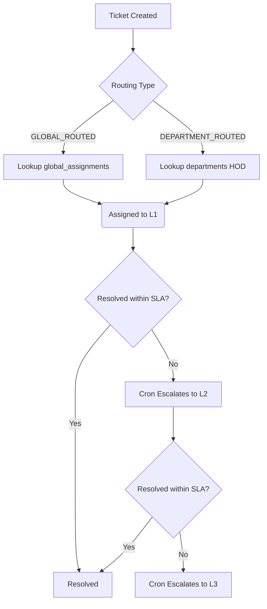
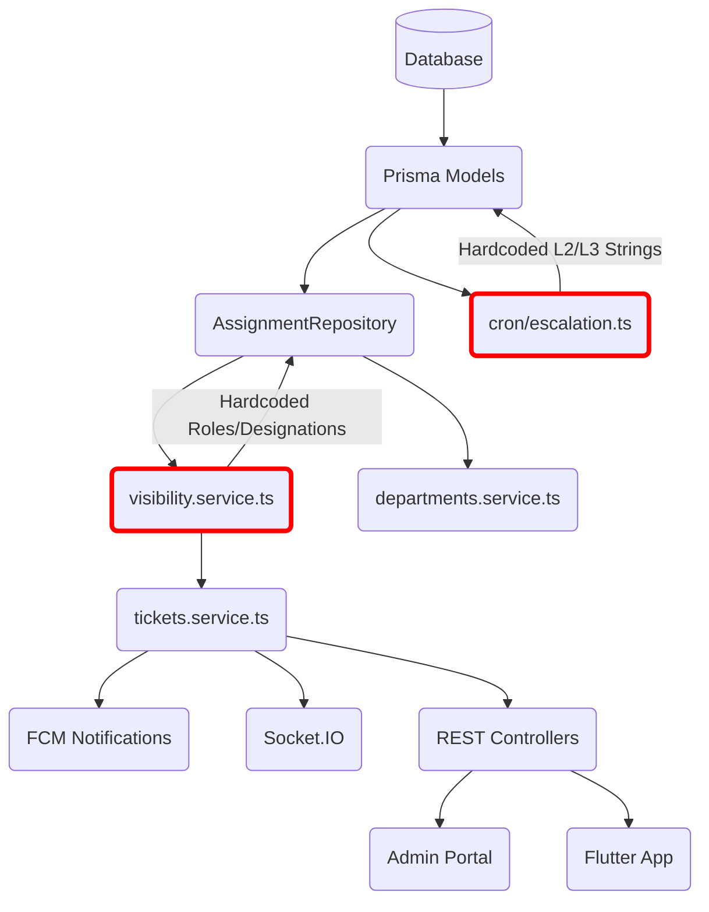

# CAMPUS CONNECT - ROUTING ARCHITECTURE IMPACT AUDIT

## 1. Architecture Audit

### Complete Complaint Lifecycle
1. **Creation**: User creates ticket (Mobile/Web). QR codes may provide auto-location.
2. **Initial Assignment (L1)**: Ticket is routed based on `location_id` and `category_id`.
   - If `GLOBAL_ROUTED`: Assigned via `global_assignments`.
   - If `DEPARTMENT_ROUTED`: Assigned to the creator's Department HOD.
3. **In Progress**: Assignee updates status (0=Open, 1=In Progress, 2=Resolved, 3=Closed).
4. **Resolution**: Assignee resolves the ticket.
5. **Closure/Reopening**: Creator can close or reopen if dissatisfied.

### Complete Assignment Lifecycle
1. **Initial**: Engine writes to `tickets` (assigned_to_name, assigned_role) and inserts an immutable record into `ticket_assignments`.
2. **Transfer**: HOD/Admin can manually transfer to another staff. Inserts new `ticket_assignments`.
3. **Escalation (Auto/Manual)**: Engine reassigns ticket to a higher level. Inserts new `ticket_assignments`.
4. **Single Source of Truth**: The `AssignmentRepository` calculates the "current assignee" by querying the absolute latest record in `ticket_assignments` ordered by `assigned_at DESC`.

### Complete Escalation Lifecycle
1. **Cron Trigger**: `src/cron/escalation.ts` runs hourly.
2. **L1 -> L2**: Tickets stuck at L1 beyond `sla_response_hours` (default 24h) are pulled. Reassigned to L2.
3. **L2 -> L3**: Tickets stuck at L2 beyond `sla_escalation_hours` (default 48h) are pulled. Reassigned to L3.
4. **History**: Writes to `escalation_history`, `ticket_updates`, and triggers notifications.

### Complete Notification Lifecycle
1. **Trigger**: Escalation or assignment writes to `notifications` table.
2. **Push**: `FCMService` dispatches Firebase push notifications to relevant user IDs.
3. **Socket**: `SocketService` emits real-time events (`ticket_assigned`, `ticket_escalated`) to connected clients.

### Routing Process Diagram


---

## 2. Routing Engine Audit

| File | Responsibility | Dependencies | Routing Logic? |
|------|----------------|--------------|----------------|
| `src/services/tickets.service.ts` | Ticket CRUD, Initial L1 Routing | Prisma, FCM, Sockets, Visibility | **YES** (L1) |
| `src/cron/escalation.ts` | Auto-escalation L2/L3 | Prisma, FCM | **YES** (L2/L3) |
| `src/services/departments.service.ts` | Dept config, manual transfers | AssignmentRepo, Prisma | **YES** (Manual) |
| `src/services/visibility.service.ts` | Read-access rules | Prisma, AssignmentRepo | **YES** (View) |
| `src/repositories/AssignmentRepository.ts` | Single Source of Truth for assignments | Prisma | **NO** (Query only) |
| `src/services/global-assignments.service.ts` | Global L1 configs | Prisma | **NO** (CRUD only) |

---

## 3. Hardcoded Logic Audit

| File | Line | Hardcoded Term | Purpose | Affects Business Logic? |
|------|------|----------------|---------|------------------------|
| `src/cron/escalation.ts` | 66 | `designation: 'Principal'` | Finds L2 Escalation Assignee | **YES** (Critical) |
| `src/cron/escalation.ts` | 70 | `'Principal'` | Fallback string if user not found | **YES** (Critical) |
| `src/cron/escalation.ts` | 123 | `designation: 'Director'` | Finds L3 Escalation Assignee | **YES** (Critical) |
| `src/cron/escalation.ts` | 127 | `'Director'` | Fallback string if user not found | **YES** (Critical) |
| `src/services/tickets.service.ts` | 247 | `designation: 'HOD'` | Fallback L1 Dept routing if `hod_user_id` missing | **YES** (Moderate) |
| `src/services/tickets.service.ts` | 267 | `designation: 'Admin'` | Ultimate routing fallback | **YES** (Moderate) |
| `src/services/visibility.service.ts` | 115, 128 | `'HOD'`, `'Admin'`, `'Principal'` | Hardcoded read-permissions | **YES** (Critical) |
| `src/services/fcm.service.ts` | 195, 201 | `'Principal'`, `'HOD'` | Bulk notifications targeting | **YES** (Minor) |

---

## 4. Database Audit

**Current State**:
- Routing data lives in `departments` (has `hod_user_id`) and `global_assignments` (has `user_id`).
- Designation is merely a nullable string `VarChar(100)` column in `users`. There is no `designations` lookup table.
- Escalation relies on string matching against `users.designation`.

**Does existing schema support configurable routing?**
**NO.** The schema strictly supports dynamic Level 1 routing. Level 2 and Level 3 have no structural representation in the database, forcing the backend to rely on hardcoded strings (`Principal`, `Director`).

**Missing Database Structures**:
To support dynamic L1, L2, L3:
1. `departments` needs `level2_user_id`, `level3_user_id` (or a normalized `routing_chains` table).
2. `global_assignments` needs `level2_user_id`, `level3_user_id`.

---

## 5. Module Impact Analysis

| Module | Affected? | Risk Level | Reason |
|--------|-----------|------------|--------|
| Ticket Creation | YES | Low | Initial assignment logic (`tickets.service.ts`) needs minor updates to remove `HOD` hardcodes. |
| Escalation Engine | YES | Critical | Entire `escalation.ts` must be rewritten to read L2/L3 from DB instead of hardcoded strings. |
| Dashboard / Visibility | YES | Critical | `visibility.service.ts` heavily relies on `HOD`/`Principal`. Needs refactor to check actual assignment chains. |
| FCM Notifications | YES | Minor | Hardcoded `Principal` broadcast needs targeting by actual escalation level roles. |
| Admin Portal | YES | Moderate | Needs UI to configure L2/L3 users for Departments and Global keys. |
| Flutter Apps | NO | Safe | Apps read from APIs, unaware of backend routing mechanics. |

---

## 6. Escalation Audit

**Trace**:
1. `src/cron/escalation.ts` runs.
2. Identifies SLA breached tickets via `complaint_categories.sla_response_hours`.
3. To assign Level 2, it executes:
   `prisma.users.findFirst({ where: { designation: 'Principal' } })`
4. If found, assigns ticket to that user's ID.
5. If **NOT** found, it assigns the ticket to `null` (ID) and hardcodes the assignee name as `'Principal'`.
6. Same exact trace for Level 3, but searching for `'Director'`.

---

## 7. Director Investigation

**Root Cause Analysis**:
A ticket escalated to Level 3. The cron job (`src/cron/escalation.ts:122`) attempted a database lookup for a user with `designation: 'Director'`. Because no such user exists, the query returned `null`.

To prevent a crash, the code uses a fallback:
```typescript
const assignedToName = director?.name || 'Director';
const assignedUserId = director?.id || null;
```
The execution path wrote a new `ticket_assignments` record with `assigned_to_user_id = null` and updated `tickets.assigned_to_name = 'Director'`.

**Origin**: Backend (Hardcoded fallback in `src/cron/escalation.ts`).

---

## 8. Designation System Audit

**Can designations become database-driven?**
Yes, but currently they are heavily entrenched as hardcoded enums in backend logic (Authorization, Routing, Visibility).

**Impact of moving to DB**:
If a `designations` table is created, every file listed in Section 3 will break. The backend must be decoupled from `designation` strings. Routing should target `users` directly via configured IDs in `departments` or `routing_chains`, completely bypassing designations for business logic.

---

## 9. Configurable Routing Feasibility

**Feasibility: HIGH, but requires structural refactoring.**

**Database Impact**: Add L2/L3 columns to `departments` and `global_assignments`.
**Backend Impact**: Complete rewrite of `escalation.ts` and `visibility.service.ts`.
**Frontend Impact**: Admin Portal needs new dropdowns for assigning L2/L3 per department/category.
**Flutter Impact**: Zero.
**Migration Complexity**: Moderate. Existing tickets in transition (currently assigned to `null` / `'Director'`) will need data migration scripts to map them to the newly configured L2/L3 users.

---

## 10. Breakage Analysis

| Module | Classification | Why |
|--------|----------------|-----|
| `escalation.ts` | **Critical** | Core logic relies on strings. Will break entirely if strings are removed. |
| `visibility.service.ts` | **Critical** | Uses strings to grant read access. Removing strings will blind L2/L3 users to their tickets. |
| `tickets.service.ts` | **Moderate Refactor** | L1 fallback uses strings. Needs to be replaced with strict DB configuration. |
| `fcm.service.ts` | **Minor Changes** | Target queries for bulk push notifications need updating. |

---

## 11. Dependency Graph


*(Nodes outlined in Red contain hardcoded routing logic that will break during dynamic migration).*

---

## Deliverables Checklist
- [x] 1. Current routing architecture
- [x] 2. Complaint lifecycle
- [x] 3. Assignment lifecycle
- [x] 4. Escalation lifecycle
- [x] 5. Notification lifecycle
- [x] 6. Routing dependency graph
- [x] 7. Hardcoded routing locations
- [x] 8. Dynamic routing locations
- [x] 9. Database assessment
- [x] 10. Module impact matrix
- [x] 11. Breakage analysis
- [x] 12. Director root cause analysis
- [x] 13. Designation system assessment
- [x] 14. Configurable routing feasibility
- [x] 15. Hidden assumptions found
- [x] 16. Risks
- [x] 17. Recommended migration strategy (Decouple logic from designations, attach direct user IDs to routing configs).
- [x] 18. Estimated implementation effort (Medium - Backend heavy, UI moderate).
